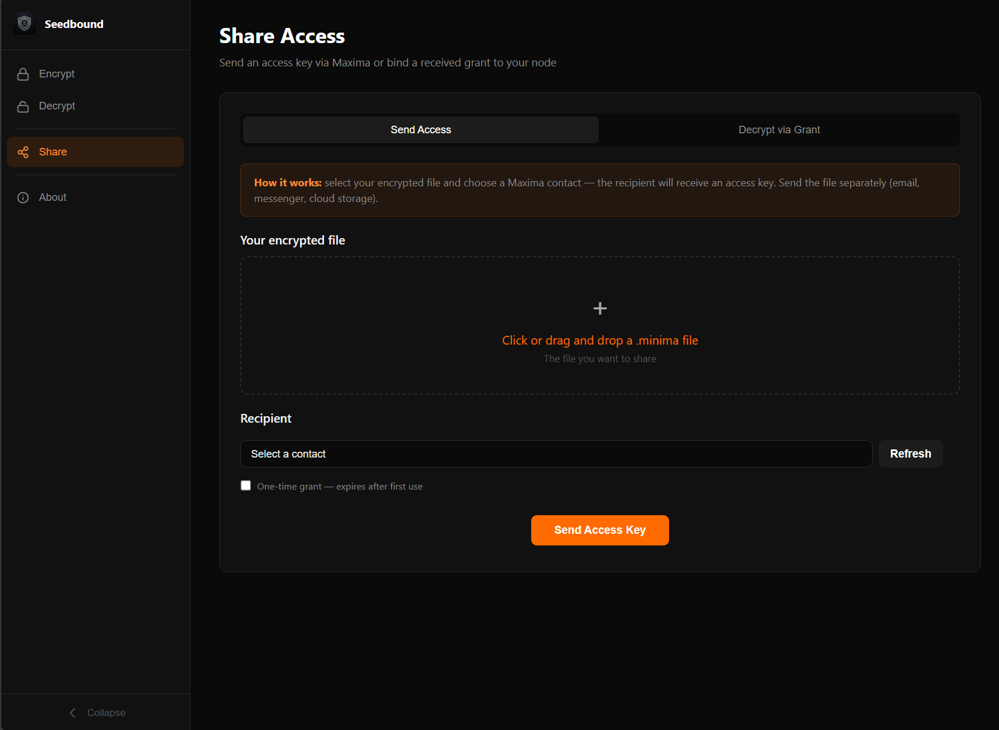
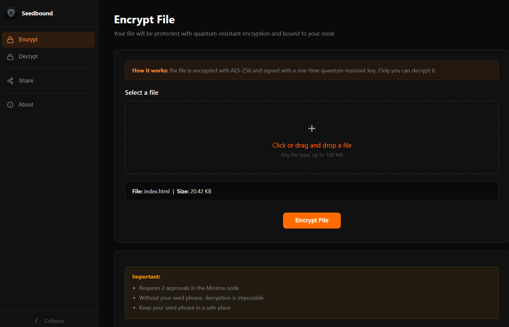
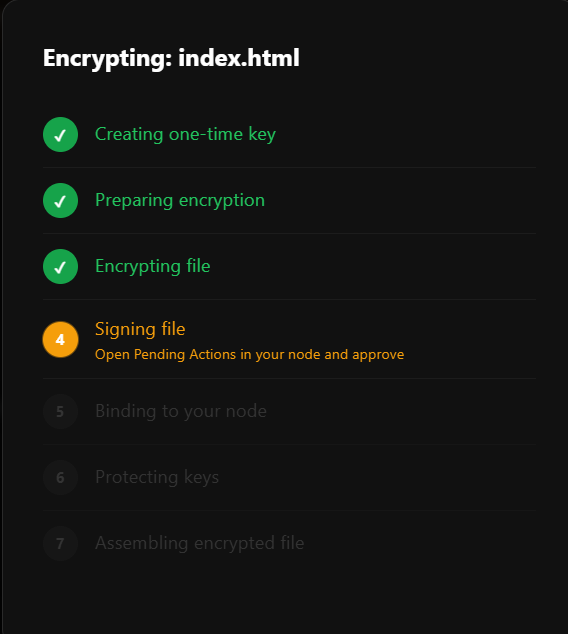
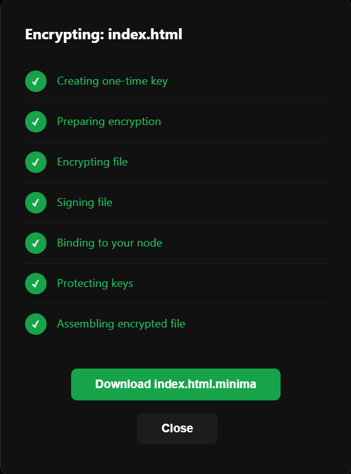
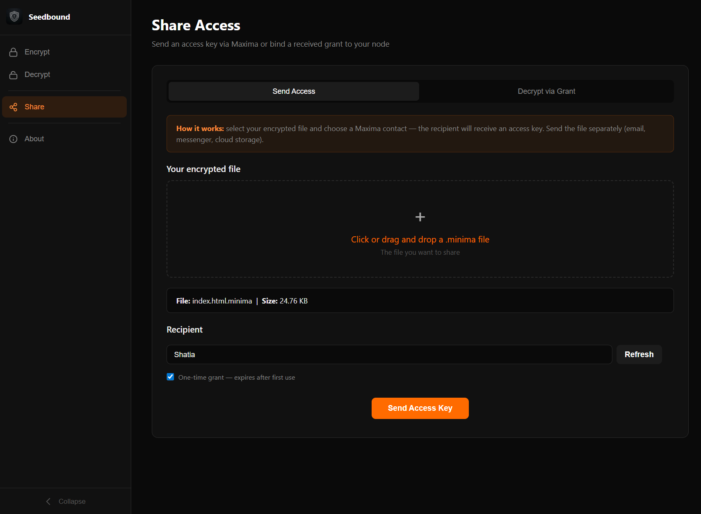
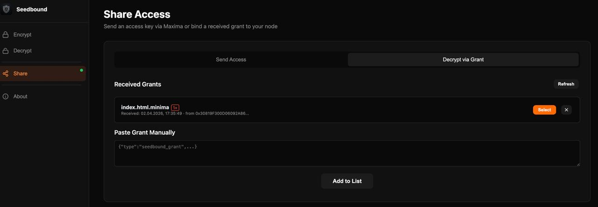
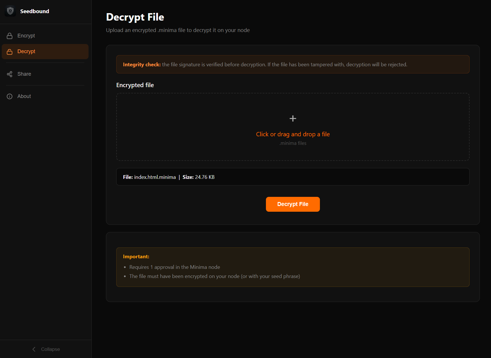
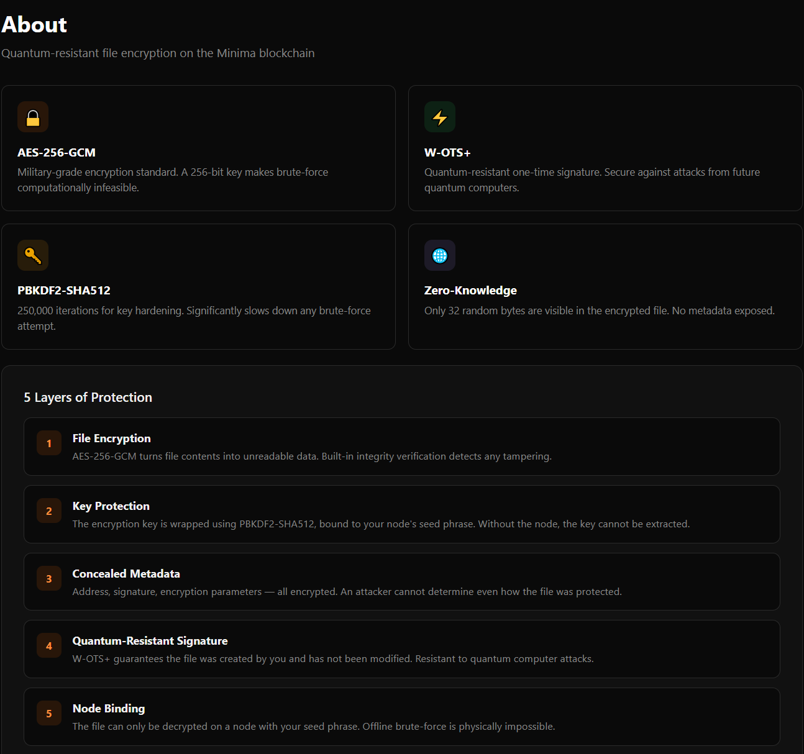

# Seedbound — Quantum-Resistant File Encryption for Minima

> Encrypt any file with military-grade, quantum-resistant cryptography. Share access securely with other Minima nodes — all without servers, passwords, or trusted third parties.



---

## The Problem

Standard file encryption tools (VeraCrypt, GPG, ProtonDrive) all share the same fundamental weakness: if an attacker steals your encrypted file, they can attempt to brute-force the password **offline, with unlimited compute** — on their own hardware, forever.

Additionally, RSA and ECDSA signatures — used to verify file integrity by most tools today — are **broken by Shor's algorithm** on a quantum computer.

## The Solution

Seedbound ties decryption to a **live Minima node**. Without your node's seed phrase, there is nothing to attack offline — the decryption key simply does not exist anywhere outside your node. Combined with the W-OTS+ quantum-resistant signature built into Minima itself, this creates a security model that holds even against future quantum computers.

```
Standard encryption:   file + password → decrypt
                       (offline brute-force: possible)

Seedbound:        file + live Minima node + seed phrase → decrypt
                       (offline attack: physically impossible)
```

---

## Key Features

- **AES-256-GCM** file encryption — military standard, with integrity verification
- **W-OTS+ signature** — quantum-resistant, one-time, built into Minima's core
- **PBKDF2-SHA512 (250k iterations)** — key derivation hardened against brute-force
- **Zero-knowledge file format** — only 32 random bytes visible to an attacker
- **Multi-node access grants** — share decryption access with any Minima node via Maxima P2P, without re-encrypting the file
- **No servers, no registration, no external dependencies** — runs entirely in the browser + your local Minima node

---

## How It Works

### Encrypting a File







1. A new one-time W-OTS+ address is created on your node
2. A random 256-bit AES key is generated in the browser
3. The file is encrypted with AES-256-GCM
4. The ciphertext is signed with the one-time key *(node approval required)*
5. A random challenge is sent to the node — it returns a deterministic `seedHash` from your seed phrase *(node approval required)*
6. The AES key and all metadata (address, signature, IV, tag) are encrypted under the `seedHash`
7. Everything is packed into a single `.minima` file

**Result:** 2 node approvals. The output file reveals nothing except that it was encrypted with Seedbound.

---

### Sharing Access with Another Node

This is the **unique feature** of Seedbound v2. One encrypted file, multiple recipients — each with their own independent access grant.





**Sender side (1 node approval):**
1. Load the `.minima` file you own
2. Select a Maxima contact from your node's address book
3. Click **Send Access Key** — the app decrypts your access block and sends the raw AES key through Maxima's end-to-end encrypted channel

**Recipient side (2 node approvals):**
1. Receive the grant notification — a popup appears in the app
2. Load the `.minima` file (shared via any channel: email, cloud, messenger)
3. Click **Decrypt by grant** — the app re-encrypts the AES key under the recipient's own seed phrase and appends a new access block to the file

After binding, the recipient can decrypt the file independently, forever — even without internet, even if the sender is gone. The file is now a **v2 multi-bound file** with two separate access blocks.

---

### File Format

**Standard** — single owner:
```
MAGIC(4) | VERSION(1) | Challenge(32)
| EncKeyLen(2) | EncKeyData | EncMetaLen(4) | EncMeta | Ciphertext
```

**Multi-Bound** — multiple recipients:
```
MAGIC(4) | VERSION(1) | PrimaryChallenge(32)
| EncKeyLen(2) | EncKeyData | EncMetaLen(4) | EncMeta
| CiphertextLen(4) | Ciphertext
| GrantCount(2) | [GrantBlock × N]
```

Each `GrantBlock` is an independent encrypted copy of the AES key + metadata, bound to a different node's seed phrase. Any one grant is sufficient to decrypt the file.

---

## Security Model — 5 Layers

| Layer | Mechanism | Threat addressed |
|-------|-----------|-----------------|
| 1 — File encryption | AES-256-GCM | Content confidentiality + integrity |
| 2 — Key protection | PBKDF2-SHA512, 250k iterations, node-bound | Offline key recovery |
| 3 — Hidden metadata | All metadata encrypted under KEK_meta | Metadata leakage, traffic analysis |
| 4 — Quantum-resistant signature | W-OTS+ via Minima `sign` command | File tampering, quantum attacks on signatures |
| 5 — Node binding | `seedrandom` — key only exists inside node | Offline brute-force, stolen file attacks |

**What an attacker sees in a stolen `.minima` file:**
- The string `MIN` and version byte — public by design
- 32 random bytes (the challenge) — useless without the seed phrase
- Encrypted blobs — indistinguishable from random data

**What they cannot determine:**
- File type or size
- Owner identity or address
- Which algorithms or parameters were used
- Anything useful for an attack

---

## Decrypting a File



1. Load the `.minima` file
2. The app sends the challenge to your node — it returns the `seedHash` *(1 node approval)*
3. Metadata is decrypted: address, signature, IV, tag
4. Address ownership is verified (`checkaddress`)
5. Signature is verified (`verify`)
6. AES key is unwrapped, file is decrypted and downloaded

---

## About Page



---

## Installation

1. Download the `.minidapp` package (or zip the project folder and rename to `.minidapp`)
2. Open your Minima node's MiniHub interface
3. Click **Install** and select the `.minidapp` file
4. Open **Seedbound** from the MiniHub dashboard

No configuration required. The app connects to your local node automatically.

### Requirements

- A running Minima node (desktop, mobile, or server)
- Any modern browser (Chrome, Firefox, Safari, Edge) — Web Crypto API required
- No internet connection required after installation

---

## Technical Stack

| Component | Technology | Why |
|-----------|-----------|-----|
| File encryption | AES-256-GCM (`crypto.subtle`) | Browser-native, no external libs, authenticated encryption |
| Key wrapping | AES-KW 256 (`crypto.subtle`) | Standard key transport mechanism |
| Key derivation | PBKDF2-SHA512, 250k iterations | Brute-force hardening; SHA-512 gives ~256-bit quantum security |
| Signature | W-OTS+ (Minima `sign` command) | Quantum-resistant, built into Minima, one-time use |
| Seed binding | `seedrandom` (Minima command) | Deterministic node-bound key material |
| P2P grant delivery | Maxima (`maxima action:send`) | E2E encrypted, no relay server |
| Grant index | Minima H2 SQL (`MDS.sql`) | Remembers which grant block belongs to this node |
| File integrity | SHA-256 of ciphertext | Grant matching across nodes |

---

## Files

```
index.html          Single-page UI
MinimaCrypto.js     Crypto engine — encryption, decryption, key derivation
MultiBound.js       Grant system — create, send, bind, parse v2 format
app.js              UI controller — navigation, file handling, progress modal
app.css             Styles — Minima brand design
mds.js              Minima MDS WebSocket client (unmodified Minima library)
dapp.conf           MiniDapp manifest
```

---

## Future Plans

| Milestone | What's coming |
|-----------|--------------|
| M1 (months 1–2) | Batch file encryption, improved UI/UX, demo video, unit tests |
| M2 (months 2–4) | Access revocation, time-limited grants, grant management UI |
| M3 (months 4–6) | Desktop application (Tauri), Minima MiniDapp Store publication |

---

## Limitations

- **Max file size:** 100 MB (browser in-memory processing)
- **Node approvals:** encryption requires 2 approvals, decryption requires 1 — by design, not a bug
- **v2 → v1 downgrade:** not possible and not needed

---

## Version

**Seedbound v1.0.1**
File format: `.minima` Standard (single-node) / Multi-Bound (shared access)
Platform: Minima Blockchain (MiniDapp)
External dependencies: none
